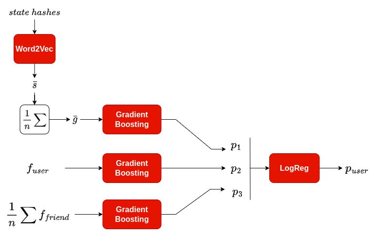

# Кейс от ВК: Машинное обучение на графах

## Описание задачи
В поставленной задаче требовалось предсказать для пользователей бинарные лейблы: склонен ли пользователь к благотворительности или нет. Для решения задачи были предоставлены разнородные данные: вещественные признаки пользователей, признаки похожих пользователей, а также последовательности некоторых состойний.

## Подход к решению
В ходе хакатона был проведен анализ полученных данных и испробованы различные подходы к решению. Окончательным способом решения оказалось применение градиентного бустинга на векторных представлениях пользователей. 

Было обучено две модели модели GB с использованием библиотеки Catboost поверх двух наборов представлений признаков пользователей:

 - вещественные признаки пользователей, объединенные со средним значением похожих признаков
 - выученные векторные представления последовательностей состояний, интерпретированные как агрегация векторных представлений вершин

Предсказываемые вероятности балансируются с помощью обучаемых весов логистической регрессии. Общая схема модели выглядит следующим образом:

## Структура проекта

**model_head_fit.ipynb*** - файл с обучением головы модели
**model_related_code.ipynb** - файл с обучением градиетных бустингов, скрытых представлений графов, эмбедингов и всего такого :)

Остальные файлы относятся больше к анализу и не совсем релевантны

## Авторы

 - Никита Хорошавцев
 - Карпухин Сергей
 - Антон Зотов
 - Артем Гришин